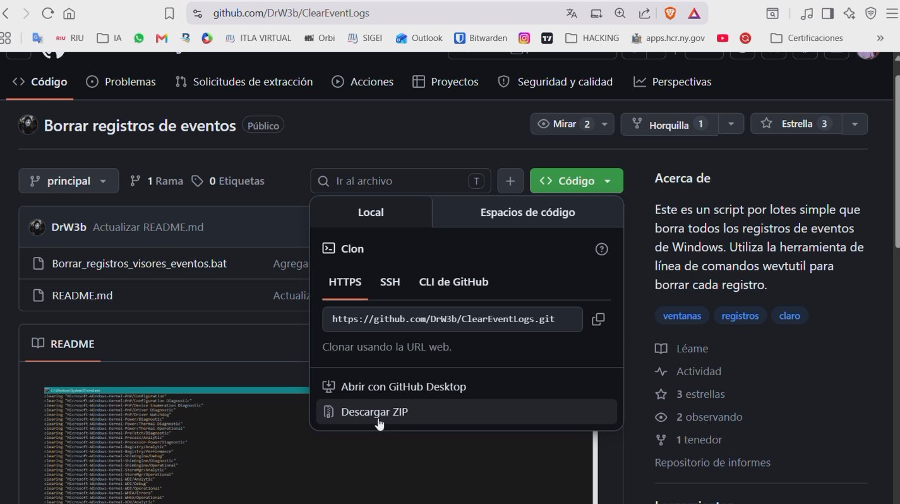
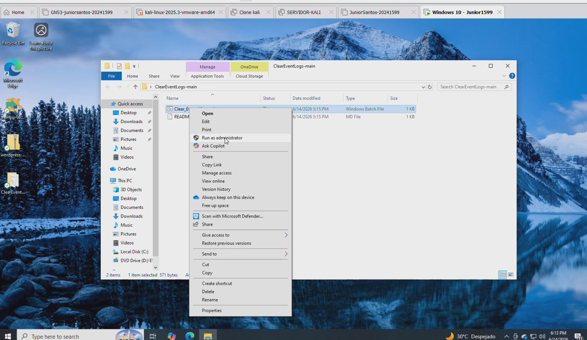
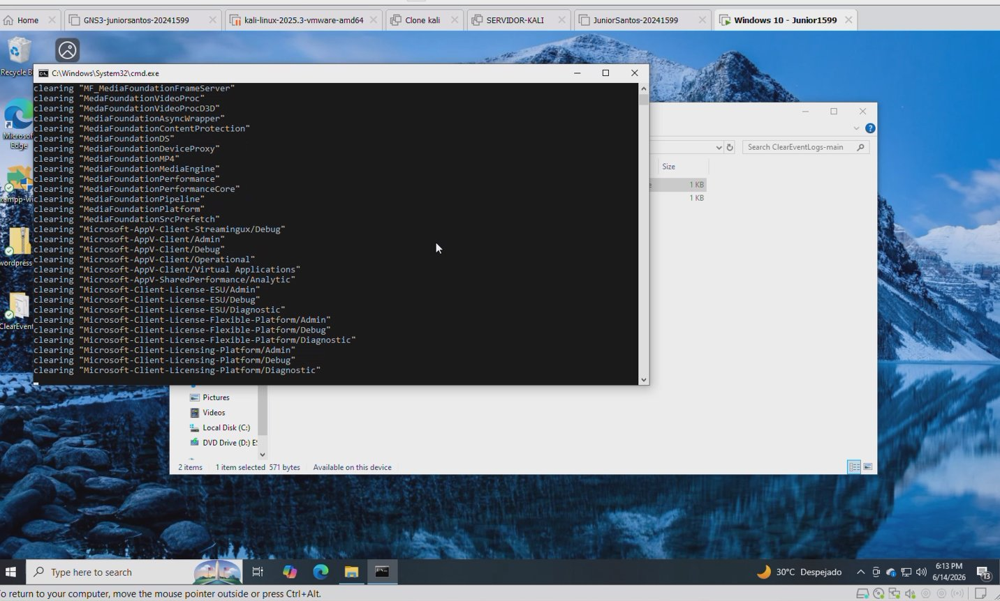
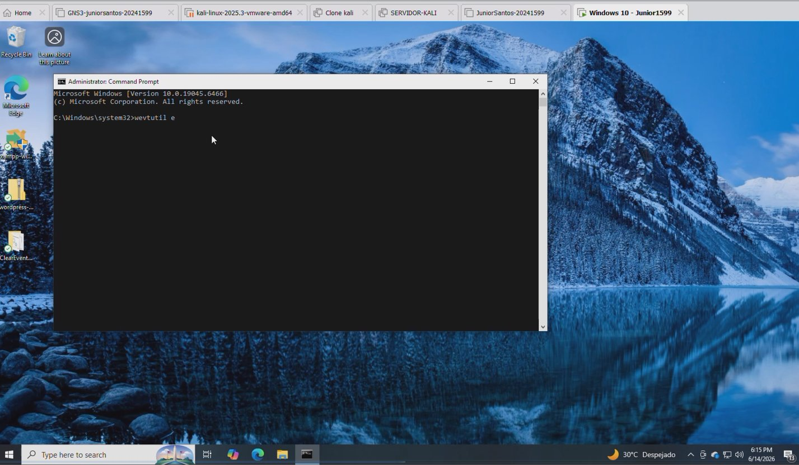
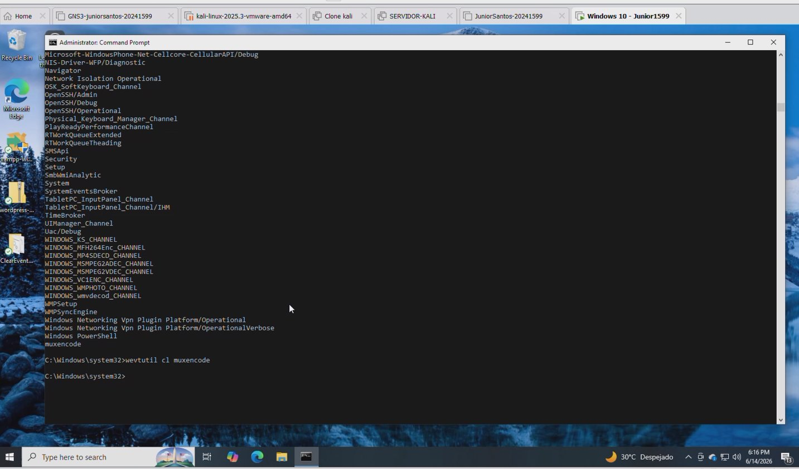
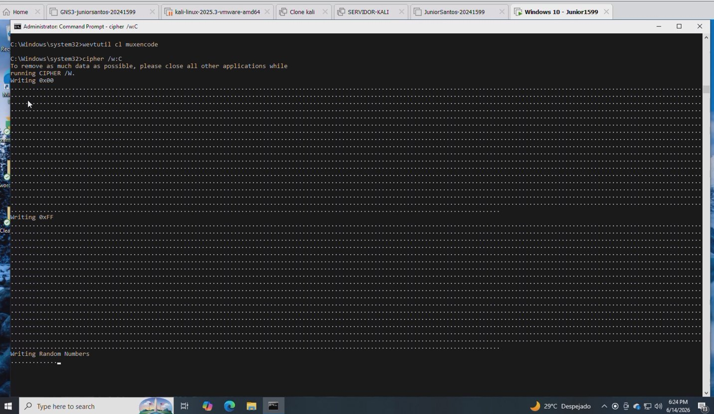

# Lab 4.2 — Borrar Registros de Máquinas Windows usando Varias Utilidades

> **Módulo 06 - System Hacking — Covering Tracks**
> **Referencia:** CEH Lab Manual Page 699 (v11) / Page 887 (v12)
> **Curso:** Ethical Hacking and Countermeasures — EC-Council
> **Estudiante:** Junior Santos
> **Fecha:** 14 de junio de 2026
> **Entorno:** Windows 10 (Build 19045) — VMware Workstation

---

## 📋 Tabla de Contenidos

1. [Objetivo](#objetivo)
2. [¿Qué son los Logs de Windows?](#qué-son-los-logs-de-windows)
3. [Task 2.1 — Clear_Event_Viewer_Logs.bat](#task-21--clear_event_viewer_logsbat)
4. [Task 2.2 — wevtutil](#task-22--wevtutil)
5. [Task 2.3 — cipher /w:C:](#task-23--cipher-wc)
6. [Conclusión](#conclusión)
7. [Medidas Defensivas](#medidas-defensivas)

---

## 🎯 Objetivo

Demostrar cómo un atacante con acceso a una máquina Windows puede **borrar toda evidencia de su actividad** utilizando tres utilidades distintas:

- `Clear_Event_Viewer_Logs.bat` — Script batch para limpiar todos los logs de eventos
- `wevtutil` — Herramienta nativa de Windows para gestionar logs individualmente
- `cipher /w:C:` — Sobreescritura de espacio libre para hacer archivos irrecuperables

> ⚠️ **AVISO LEGAL:** Este laboratorio se realizó en un entorno virtual controlado con fines exclusivamente educativos dentro del programa EC-Council CEH. Aplicar estas técnicas en sistemas sin autorización es ilegal.

---

## 📁 ¿Qué son los Logs de Windows?

Los logs (registros) de Windows son archivos `.evtx` almacenados en:

```
C:\Windows\System32\winevt\Logs\
```

Windows registra automáticamente **todo lo que ocurre en el sistema**:

| Log | Qué registra |
|---|---|
| **Application** | Programas ejecutados, errores de aplicaciones |
| **Security** | Inicios de sesión, accesos a archivos, cambios de permisos |
| **System** | Drivers, hardware, servicios del sistema operativo |

Estos logs son la **principal fuente de evidencia forense** después de un ataque. Por eso un atacante busca borrarlos para no dejar rastro.

---

## Task 2.1 — Clear_Event_Viewer_Logs.bat

### ¿Qué es?

Script batch descargado desde GitHub (`github.com/DrW3b/ClearEventLogs`) que utiliza internamente `wevtutil` para borrar **todos** los logs de eventos de Windows de forma automatizada en una sola ejecución.

### Descarga desde GitHub

El script fue descargado directamente desde el repositorio público **DrW3b/ClearEventLogs** usando la opción **"Descargar ZIP"**:


*Figura 1 — Repositorio GitHub DrW3b/ClearEventLogs; se descargó el ZIP con el script batch*

### Ejecución

1. Se extrajo el ZIP descargado
2. Se hizo **clic derecho** sobre `Clear_Event_Viewer_Logs.bat`
3. Se seleccionó **"Run as administrator"**
4. Se aceptó el UAC → **Yes**


*Figura 2 — Ejecución del script batch con privilegios de administrador desde el Explorador de archivos*

### Resultado

El CMD se abrió automáticamente y comenzó a limpiar todos los logs uno por uno:

```
clearing "MF_MediaFoundationFrameServer"
clearing "MediaFoundationVideoProc"
clearing "Microsoft-AppV-Client/Operational"
clearing "Microsoft-Client-License-ESU/Admin"
clearing "Microsoft-Client-Licensing-Platform/Diagnostic"
...
```


*Figura 3 — El script borra automáticamente cientos de logs; la ventana CMD se cierra sola al terminar*

> **Nota:** Este script usa `wevtutil cl` internamente para cada log de la lista. Es equivalente a ejecutar `wevtutil cl` manualmente para cada uno, pero completamente automatizado.

---

## Task 2.2 — wevtutil

### ¿Qué es `wevtutil`?

Herramienta **nativa de Windows** (no requiere instalación) para gestionar el Visor de Eventos directamente desde CMD con control preciso sobre cada log.

### Comandos principales

| Comando | Función |
|---|---|
| `wevtutil el` | Lista todos los logs disponibles |
| `wevtutil gl <nombre>` | Ver información de un log específico |
| `wevtutil cl <nombre>` | **Borrar** un log específico |
| `wevtutil qe <nombre>` | Consultar eventos de un log |

### Paso 1 — Abrir CMD como administrador

Se buscó `cmd` en la barra de tareas → clic derecho → **Run as administrator** → UAC → **Yes**


*Figura 4 — CMD con privilegios de administrador listo para ejecutar wevtutil*

### Paso 2 — Listar todos los logs

```cmd
wevtutil el
```

Se listaron todos los registros de eventos del sistema, incluyendo logs críticos como `Security`, `System`, `Application`, `OpenSSH`, `Windows PowerShell`, entre cientos más.


*Figura 5 — wevtutil el muestra todos los logs disponibles; al final se ejecutó `wevtutil cl muxencode` exitosamente*

### Paso 3 — Borrar un log específico

```cmd
wevtutil cl muxencode
```

El comando no devolvió error, confirmando que el log fue borrado exitosamente. ✅

### Logs más importantes que un atacante borraría

```cmd
wevtutil cl Security
wevtutil cl Application
wevtutil cl System
wevtutil cl "Windows PowerShell"
```

---

## Task 2.3 — cipher /w:C:

### ¿Qué es `cipher /w`?

Herramienta **nativa de Windows** que sobreescribe el espacio libre del disco en **3 pasadas**, haciendo que los archivos previamente borrados sean **completamente irrecuperables**, incluso con software forense avanzado.

### ¿Por qué es necesario?

```
Solo borrar un archivo o log:
  Windows elimina el "puntero" al archivo
  → Los datos físicos SIGUEN en el disco
  → Recuperable con Recuva, FTK, Autopsy ⚠️

Con cipher /w:
  Los datos físicos son sobreescritos 3 veces
  → Irrecuperable con cualquier herramienta ✅
```

### Ejecución

```cmd
cipher /w:C:
```

El proceso realizó las 3 pasadas de sobreescritura:

```
Writing 0x00    ← Pasada 1: sobreescribe con ceros
Writing 0xFF    ← Pasada 2: sobreescribe con 255s
Writing Random  ← Pasada 3: sobreescribe con números aleatorios
```


*Figura 6 — cipher /w:C: completó las 3 pasadas (0x00, 0xFF, Random Numbers) sobre el espacio libre de C:*

> **Nota técnica:** `cipher.exe` es una herramienta integrada en Windows diseñada originalmente para cifrar archivos en particiones NTFS. El parámetro `/w` la convierte en una herramienta de borrado seguro del espacio libre.

---

## ✅ Conclusión

Esta práctica es muy importante porque demuestra que **el acceso al sistema no es el único peligro** — lo que el atacante hace después de entrar para borrar sus huellas es igualmente crítico.

Si un atacante logra abrir un **CMD como administrador**, puede eliminar toda evidencia de su actividad:

```
✅ Clear_Event_Viewer_Logs.bat  → Borra TODOS los logs de una vez automáticamente
✅ wevtutil cl <log>            → Borra logs específicos de forma precisa y silenciosa
✅ cipher /w:C:                 → Hace irrecuperables todos los archivos borrados del disco
```

Un equipo de análisis forense que llegue después **no encontrará ninguna evidencia** del ataque si el atacante ejecutó estas herramientas correctamente.

---

## 🛡️ Medidas Defensivas

Para que estas técnicas no eliminen la evidencia completamente, los equipos de seguridad implementan:

| Medida | Cómo protege |
|---|---|
| **SIEM** (Splunk, ELK) | Envía los logs a un servidor externo en tiempo real; aunque se borren localmente, ya están guardados en otro lugar |
| **Backups de logs** | Copia automática de eventos en servidor separado cada X minutos |
| **Alertas en tiempo real** | Notifica al equipo de seguridad si alguien ejecuta `wevtutil cl` o borra logs |
| **Principio de mínimo privilegio** | Los usuarios normales no pueden ejecutar CMD como administrador |
| **Windows Event Forwarding** | Reenvía eventos a un colector centralizado fuera del alcance del atacante |

> 📌 **Lección clave:** Un atacante que conoce *Covering Tracks* es difícil de detectar. Un defensor que conoce estas técnicas sabe exactamente qué monitorear y dónde buscar evidencia alternativa.

---

> 📌 **Nota:** Todo el laboratorio fue ejecutado en un entorno virtual aislado (VMware Workstation) con fines académicos dentro del programa EC-Council Ethical Hacking and Countermeasures. Ningún sistema real fue comprometido.
